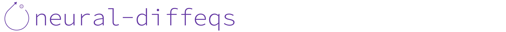

.. title:: neural-diffeqs

.. raw:: html

    <embed>
        

          
          
        

    </embed>
    

.. toctree::
   :hidden:

   quickstart
   install
   api
   examples

.. grid:: 4
    :gutter: 1

    .. grid-item-card::    
       :link: quickstart.rst
       :text-align: right
       
       Quickstart
       ^^^
       
       .. raw:: html

          <embed>
    
</embed>

       :octicon:`flame;2em;sd-text-dark`

       
    .. grid-item-card::
       :link: install.rst
       :text-align: right
       
       Installation
       ^^^
       
       .. raw:: html

          <embed>
    
</embed>

       :octicon:`desktop-download;2em;sd-text-dark`
    
    .. grid-item-card::
       :link: api.rst
       :text-align: right
       
       API Reference
       ^^^
       
       .. raw:: html

          <embed>
    
</embed>

       :octicon:`code;2em;sd-text-dark`
       
    .. grid-item-card::
       :link: examples.rst
       :text-align: right
       
       Examples
       ^^^
       
       .. raw:: html

          <embed>
    
</embed>

       :octicon:`sidebar-expand;2em;sd-text-dark`

.. raw:: html

    <embed>
        

          
          
        

    </embed>

* :ref:`genindex`
* :ref:`modindex`
* :ref:`search`
